# Heapster插件的安装：

[Heapster下载页](https://github.com/kubernetes/heapster/releases)

## 1、配置grafana-deployment：

```shell
vi grafana-deployment.yaml
```

**注意修改镜像地址：**

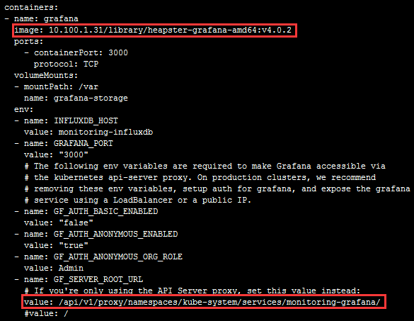

如果后续使用 kube-apiserver 或者 kubectl proxy 访问 grafana dashboard，则必须将 GF_SERVER_ROOT_URL 设置为 /api/v1/proxy/namespaces/kube-system/services/monitoring-grafana/，否则后续访问grafana时访问时提示找不到:

<http://10.100.1.31:8086/api/v1/proxy/namespaces/kube-system/services/monitoring-grafana/api/dashboards/home> 页面；

## 2、配置heapster-deployment：

```shell
vi heapster-deployment.yaml
```

**注意修改镜像地址：**

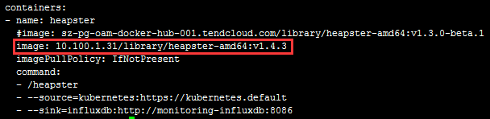

## 3、配置influxdb-deployment：

influxdb 官方建议使用命令行或 HTTP API 接口来查询数据库，从 v1.1.0 版本开始默认关闭 admin UI，将在后续版本中移除 admin UI 插件。

**导出镜像中的 influxdb 配置文件**

```shell
docker run --rm --entrypoint 'cat' -it jaychiu/heapster-influxdb-amd64:v1.1.1/etc/config.toml > config.toml.orig
cp config.toml.orig config.toml
vi config.toml
```

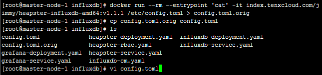

**修改：启用 admin 接口**

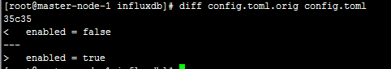

将修改后的配置写入到 ConfigMap 对象中

```shell
kubectl create configmap influxdb-config --from-file=config.toml -n kube-system
```

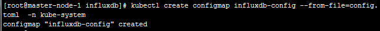

将 ConfigMap 中的配置文件挂载到 Pod 中，达到覆盖原始配置的目的

```shell
vi influxdb-deployment.yaml
```

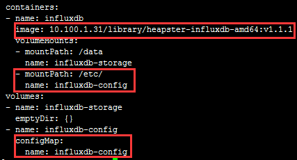

## 4、配置influxdb-service：

```shell
vi influxdb-service.yaml
```

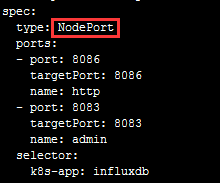

定义端口类型为 NodePort，额外增加了 admin 端口映射，用于后续浏览器访问 influxdb 的 admin UI 界面；

## 5、执行所有定义文件：

```shell
kubectl create -f  .
```

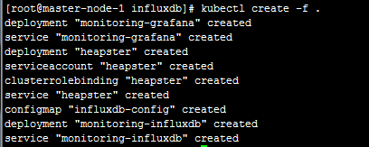

## 6、检查服务：

**deployment：**

```shell
kubectl get deployments -n kube-system |grep -E 'heapster|monitoring'
```
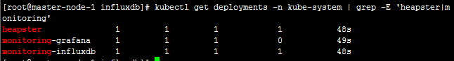

**pods：**

```shell
kubectl get pods -n kube-system | grep -E'heapster|monitoring'
```
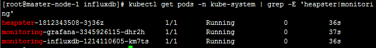

检查 kubernetsdashboard 界面，看是显示各 Nodes、Pods 的 CPU、内存、负载等利用率曲线图；

**service：**

```shell
kubectl get svc -n kube-system -o wide |grep -E 'heapster|monitoring'
```

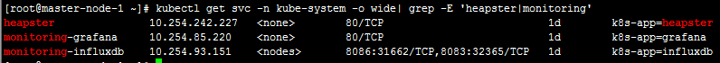

**检查所有服务：**

```shell
kubectl describe svc/kubernetes-dashboard -nkube-system
```
```shell
kubectl describe svc/heapster -nkube-system
```
```shell
kubectl describe svc/monitoring-grafana -nkube-system
```
```shell
kubectl describe svc/monitoring-influxdb -nkube-system
```
## 7、访问grafana：

### 7.1、通过kube-apiserver 访问：

<http://x.x.x.x:8080/api/v1/proxy/namespaces/kube-system/services/monitoring-grafana/>

### 7.2、通过kubectl proxy 访问：

```shell
kubectl proxy --address='x.x.x.x'--port=8086 --accept-hosts='^*$'
Starting to serve on x.x.x.x:8086
```

<http://x.x.x.x:8086/api/v1/proxy/namespaces/kube-system/services/monitoring-grafana>

### 注意：

在安装好 Grafana 之后我们使用的是默认的 template 配置，页面上的 namespace 选择里只有 `default` 和 `kube-system`，并不是说其他的 namespace 里的指标没有得到监控，只是我们没有在 Grafana 中开启他它们的显示而已。

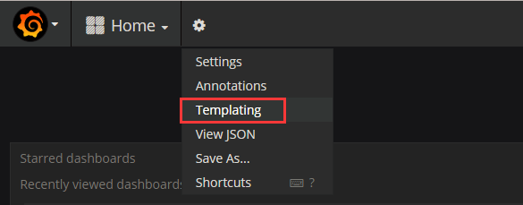

将 Templating中的 namespace 的 Data source 设置为 influxdb-datasource，Refresh 设置为 on Dashboard Load 保存设置，刷新浏览器，即可看到其他namespace 选项。

```shell
show tag values from 'uptime' with key='namespace_name'
```

## 8、访问influxdb admin UI：

```shell
kubectl get svc -n kube-system|grepinfluxdb
```

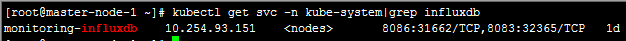

<http://192.168.10.117:8080/api/v1/proxy/namespaces/kube-system/services/monitoring-influxdb:8083/>

在页面的 “Connection Settings” 的 Host 中输入 node IP，Port 中输入 8086 映射的 nodePort 如上面的31662，点击 “Save” 即可：

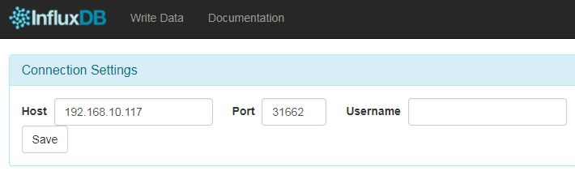
