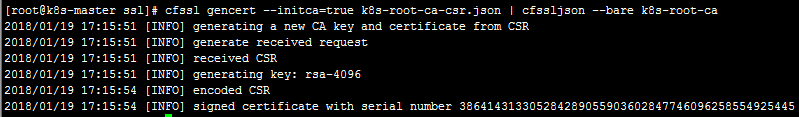

# Kubernetes集群部署

参考链接如下：

入坑文档：[Jimmysong的文档](https://jimmysong.io/kubernetes-handbook/practice/install-kubernetes-on-centos.html)

进阶文档：[K仔的文档](https://blog.lannerko.cn)

# 一、部署说明：

## 1、节点：

| IP          | Role        | Hostname   | Install  service                                             |
| ----------- | ----------- | ---------- | ------------------------------------------------------------ |
| 10.100.1.31 | Master      | k8s-master | flanneld，kube-apiserver，  kube-controller-manager，kube-scheduler |
| 10.100.1.26 | Node1,etcd1 | k8s-node-1 | Etcd，flanneld，docker，kubelet                              |
| 10.100.1.27 | Node2,etcd2 | k8s-node-2 | Etcd，flanneld，docker，kubelet                              |
| 10.100.1.28 | Node3,etcd3 | K8s-node-3 | Etcd，flanneld，docker，kubelet                              |

## 2、网络结构：

| Name     | IP block      |
| -------- | ------------- |
| 集群网络 | 172.20.0.0/16 |
| svc网络  | 172.21.0.0/16 |
| 物理网络 | 10.100.1.0/24 |

## 3、资源版本及配置：

| Name           | Value                                                        | Desc                                                         |
| :------------- | ------------------------------------------------------------ | ------------------------------------------------------------ |
| OS             | Centos7.4.1708                                               | 内核版本升级到：  Linux 4.14.14-1.el7.elrepo.x86_64          |
| K8s版本        | 1.9                                                          |                                                              |
| 各组件资源下载 | 百度网盘链接：  <https://pan.baidu.com/s/1pMO1JcR>  密码：9yh3 |                                                              |
| Yaml下载       | 百度网盘链接：  <https://pan.baidu.com/s/1mjWFvNa>  密码：m0d0 |                                                              |
| Docker         | 17.12-ce                                                     | 安装方式：  export CHANNEL=stable && curl  -fsSL https://get.docker.com/ \| sh -s -- --mirror Aliyun |
| Storage        | Driver：overlay2                                             |                                                              |
| Cgroup         | Driver：systemd                                              |                                                              |
| Etcd           | 3.2.9                                                        | yum -y install etcd                                          |
| Flanneld       | 0.7.1                                                        | yum -y install flannel                                       |
| Dashboard      | 1.8                                                          |                                                              |
| OS user        | root                                                         |                                                              |

## 4、检查日志：

`journalctl -xe`

`tail -300f /var/log/message`

# 二、基础安装：

## 1、所有主机修改host文件：

`vi /etc/hosts`

**master主机添加以下内容：**

`127.0.0.1 k8s-master`

`10.100.1.26 k8s-node-1`

`10.100.1.27 k8s-node-2`

`10.100.1.28 k8s-node-3`

**非master主机添加以下内容：**

`10.100.1.31 k8s-master`

`10.100.1.26 k8s-node-1`

`10.100.1.27 k8s-node-2`

`10.100.1.28 k8s-node-3`

**为方便操作全部在master主机上进行，在master主机上执行以下命令：**

**Master主机生成公私钥：**

`ssh-keygen -t rsa`

**在其他两个主机新建目录/root/.ssh/，然后在master主机执行以下命令：**

`cd /root/.ssh/`

`for item in {k8s-node-1,k8s-node-2};do`

`scp -r id_rsa.pub ${item}:/root/.ssh/authorized_keys`

`done`

## 2、所有主机关闭防火墙：

`systemctl stop firewalld`

`systemctl disable firewalld`

## 3、所有主机关闭SELinux：

`vi /etc/selinux/config`

`SELINUX=disabled`

**运行命令setenforce0 临时关闭或保存重启。**

## 4、所有etcd节点关闭swap：

`vi /etc/fstab`

**注释掉swap一行后保存重启服务器。**

## 5、所有主机升级内核版本：

**1、下载仓库：**

`rpm --importhttps://www.elrepo.org/RPM-GPG-KEY-elrepo.org`

`rpm -Uvh http://www.elrepo.org/elrepo-release-7.0-2.el7.elrepo.noarch.rpm`

**2、查看可用的内核相关包：**

`yum --disablerepo="*"--enablerepo="elrepo-kernel" list available`

**3、安装最新主线文档内核：**

`yum --enablerepo=elrepo-kernel installkernel-ml`

**4、设置grub默认内核版本：**

`vi /etc/default/grub`**设置**`GRUB_DEFAULT=0`

**5、重新创建内核配置 ：**

`grub2-mkconfig -o /boot/grub2/grub.cfg`

**6、查看已安装内核版本列表：**

`awk -F\' '$1=="menuentry " {print$2}' /etc/grub2.cfg`

# 三、软件安装：

`yum -y install ipvsadm rsync go git`

## 1、Master主机操作：

**新建/root/k8s-soft目录解压安装文件：**

`cd /root/k8s-soft`

`tar -zxvf *.tar.gz`

**创建node,master,etcd所需的二进制文件目录，方便后续修改文件；**

`mkdir -p /root/kubernetes/server/bin/{node,master,etcd}`

**复制二进制文件到各个归类的目录下面：**

`cp -r k8s-soft/kubernetes/server/bin/kubelet kubernetes/server/bin/node/`

`cp -r k8s-soft/mk-docker-opts.sh kubernetes/server/bin/node/`

`cp -r k8s-soft/flanneld kubernetes/server/bin/node/`

`cp -r k8s-soft/kubernetes/server/bin/kube-* kubernetes/server/bin/master/`

`cp -r k8s-soft/kubernetes/server/bin/kubelet kubernetes/server/bin/master/`

`cp -r k8s-soft/kubernetes/server/bin/kubectl kubernetes/server/bin/master/`

`cp -r k8s-soft/etcd-v3.2.11-linux-amd64/etcd* kubernetes/server/bin/etcd/`

**把二进制文件发送到其他主机：**

`for node in k8s-master k8s-node-1 k8s-node-2 k8s-node-3;do`

`rsync -avzP /root/kubernetes/server/node/ ${node}:/usr/local/bin/`

`done`

`for master in k8s-master;do`

`rsync -avzP /root/kubernetes/server/master/ ${master}:/usr/local/bin/`

`done`

`for etcd in k8s-node-1 k8s-node-2 k8s-node-3;do`

`rsync -avzP /root/kubernetes/server/etcd/ ${etcd}:/usr/local/bin/`

`done`

## 2、创建service文件：

**创建service归类目录：**

`mkdir kubernetes/server/{node-service,master-service,etcd-service,docker-service,ssl`

### 2.1、创建node所需的服务：

#### 2.1.1、docker.service

`cat>/root/kubernetes/server/node-service/docker.service <<'HERE'`

`[Unit]`

`Description=Docker Application Container Engine`

`Documentation=http://docs.docker.io`

`[Service]`

`Environment="PATH=/usr/local/bin:/bin:/sbin:/usr/bin:/usr/sbin"`

`EnvironmentFile=-/run/flannel/docker`

`ExecStart=/usr/bin/dockerd --log-level=error$DOCKER_NETWORK_OPTIONS \`

`--exec-opt native.cgroupdriver=systemd`

`ExecReload=/bin/kill -s HUP $MAINPID`

`Restart=on-failure`

`RestartSec=5`

`LimitNOFILE=infinity`

`LimitNPROC=infinity`

`LimitCORE=infinity`

`Delegate=yes`

`KillMode=process`

`[Install]`

`WantedBy=multi-user.target`

`HERE`

#### 2.1.2、kubelet.service

`cat >/root/kubernetes/server/node-service/kubelet.service<<'HERE'`

`[Unit]`

`Description=Kubernetes Kubelet`

`Documentation=https://github.com/GoogleCloudPlatform/kubernetes`

`After=docker.service`

`Requires=docker.service`

`[Service]`

`WorkingDirectory=/var/lib/kubelet`

`ExecStart=/usr/local/bin/kubelet \`

`--address=10.100.1.26 \`

`--hostname-override=k8s-node-1 \`

`--pod-infra-container-image=registry.access.redhat.com/rhel7/pod-infrastructure:latest\`

`--experimental-bootstrap-kubeconfig=/etc/kubernetes/ssl/bootstrap.kubeconfig\`

`--kubeconfig=/etc/kubernetes/ssl/kubeconfig \`

`--cert-dir=/etc/kubernetes/ssl \`

`--hairpin-mode promiscuous-bridge \`

`--allow-privileged=true \`

`--serialize-image-pulls=false \`

`--logtostderr=true \`

`--cgroup-driver=systemd \`

`--cluster_dns=172.21.0.2 \`

`--cluster_domain=cluster.local \`

`--v=2`

`Restart=on-failure`

`RestartSec=5`

`[Install]`

`WantedBy=multi-user.target`

`HERE`

**说明：**

这个文件默认配置的是k8s-node-1的ip，复制到k8s-node-2后需要把10.100.1.27修改
成k8s-node-2的ip 10.100.1.28；

**注意：**

如果要将master节点加入集群列表内，需要将--address=10.100.1.26设置为127.0.0.1

#### 2.1.3、flanneld.service

`cat>/root/kubernetes/server/node-service/flanneld.service <<'HERE'`

`[Unit]`

`Description=Flanneld overlay address etcd agent`

`After=network.target`

`After=network-online.target`

`Wants=network-online.target`

`After=etcd.service`

`Before=docker.service`

`[Service]`

`Type=notify`

`ExecStart=/usr/local/bin/flanneld \`

`-etcd-cafile=/etc/kubernetes/ssl/k8s-root-ca.pem \`

`-etcd-certfile=/etc/kubernetes/ssl/kubernetes.pem \`

`-etcd-keyfile=/etc/kubernetes/ssl/kubernetes-key.pem \`

`-etcd-endpoints=https://10.100.1.26:2379,https://10.100.1.27:2379,https://10.100.1.28:2379 \`

`-etcd-prefix=/kubernetes/network \`

`-iface=enp0s3`

`ExecStartPost=/usr/local/bin/mk-docker-opts.sh -kDOCKER_NETWORK_OPTIONS -d /run/flannel/docker`

`Restart=on-failure`

`[Install]`

`WantedBy=multi-user.target`

`RequiredBy=docker.service`

`HERE`

### 2.2、创建master所需的服务：

#### 2.2.1、kube-apiserver.service

`cat>/root/kubernetes/server/master-service/kube-apiserver.service<<'HERE'`

`[Unit]`

`Description=Kubernetes API Server`

`Documentation=https://github.com/GoogleCloudPlatform/kubernetes`

`After=network.target`

`[Service]`

`ExecStart=/usr/local/bin/kube-apiserver \`

`--admission-control=NamespaceLifecycle,LimitRanger,ServiceAccount,DefaultStorageClass,ResourceQuota,NodeRestriction\`

`--advertise-address=10.100.1.31 \`

`--bind-address=10.100.1.31 \`

`--insecure-bind-address=127.0.0.1 \`

`--kubelet-https=true \`

`--runtime-config=rbac.authorization.k8s.io/v1beta1 \`

`--authorization-mode=Node,RBAC \`

`--anonymous-auth=false \`

`--basic-auth-file=/etc/kubernetes/basic_auth_file \`

`--enable-bootstrap-token-auth \`

`--token-auth-file=/etc/kubernetes/ssl/token.csv \`

`--service-cluster-ip-range=172.21.0.0/16 \`

`--service-node-port-range=300-9000 \`

`--tls-cert-file=/etc/kubernetes/ssl/kubernetes.pem \`

`--tls-private-key-file=/etc/kubernetes/ssl/kubernetes-key.pem\`

`--client-ca-file=/etc/kubernetes/ssl/k8s-root-ca.pem \`

`--service-account-key-file=/etc/kubernetes/ssl/k8s-root-ca-key.pem\`

`--etcd-cafile=/etc/kubernetes/ssl/k8s-root-ca.pem \`

`--etcd-certfile=/etc/kubernetes/ssl/kubernetes.pem \`

`--etcd-keyfile=/etc/kubernetes/ssl/kubernetes-key.pem \`

`--etcd-servers=https://10.100.1.26:2379,https://10.100.1.27:2379,https://10.100.1.28:2379 \`

`--enable-swagger-ui=true \`

`--allow-privileged=true \`

`--apiserver-count=3 \`

`--audit-log-maxage=30 \`

`--audit-log-maxbackup=3 \`

`--audit-log-maxsize=100 \`

`--audit-log-path=/var/lib/audit.log \`

`--event-ttl=1h \`

`--v=2`

`Restart=on-failure`

`RestartSec=5`

`Type=notify`

`LimitNOFILE=65536`

`[Install]`

`WantedBy=multi-user.target`

`HERE`

#### 2.2.2、kube-controller-manager.service:

`cat >/root/kubernetes/server/master-service/kube-controller-manager.service<<'HERE'`

`[Unit]`

`Description=Kubernetes Controller Manager`

`Documentation=https://github.com/GoogleCloudPlatform/kubernetes`

`[Service]`

`ExecStart=/usr/local/bin/kube-controller-manager \`

`--address=127.0.0.1 \`

`--master=http://127.0.0.1:8080 \`

`--allocate-node-cidrs=true \`

`--service-cluster-ip-range=172.21.0.0/16 \`

`--cluster-cidr=172.20.0.0/16 \`

`--cluster-name=kubernetes \`

`--cluster-signing-cert-file=/etc/kubernetes/ssl/k8s-root-ca.pem\`

`--cluster-signing-key-file=/etc/kubernetes/ssl/k8s-root-ca-key.pem\`

`--service-account-private-key-file=/etc/kubernetes/ssl/k8s-root-ca-key.pem\`

`--root-ca-file=/etc/kubernetes/ssl/k8s-root-ca.pem \`

`--leader-elect=true \`

`--v=2`

`Restart=on-failure`

`RestartSec=5`

`[Install]`

`WantedBy=multi-user.target`

`HERE`

#### 2.2.3、kube-scheduler.service

`cat>/root/kubernetes/server/master-service/kube-scheduler.service<<'HERE'`

`[Unit]`

`Description=Kubernetes Scheduler`

`Documentation=https://github.com/GoogleCloudPlatform/kubernetes`

`[Service]`

`ExecStart=/usr/local/bin/kube-scheduler \`

`--address=127.0.0.1 \`

`--master=http://127.0.0.1:8080 \`

`--leader-elect=true \`

`--v=2`

`Restart=on-failure`

`RestartSec=5`

`[Install]`

`WantedBy=multi-user.target`

`HERE`

### 2.3、创建etcd所需的服务：

#### 2.3.1、etcd.service

`cat >/root/kubernetes/server/etcd-service/etcd.service<<'HERE'`

`[Unit]`

`Description=Etcd Server`

`After=network.target`

`After=network-online.target`

`Wants=network-online.target`

`Documentation=https://github.com/coreos`

`[Service]`

`Type=notify`

`WorkingDirectory=/var/lib/etcd/`

`EnvironmentFile=-/etc/etcd/etcd.conf`

`ExecStart=/usr/local/bin/etcd \`

`--name=etcd01 \`

`--cert-file=/etc/kubernetes/ssl/kubernetes.pem \`

`--key-file=/etc/kubernetes/ssl/kubernetes-key.pem \`

`--peer-cert-file=/etc/kubernetes/ssl/kubernetes.pem \`

`--peer-key-file=/etc/kubernetes/ssl/kubernetes-key.pem \`

`--trusted-ca-file=/etc/kubernetes/ssl/k8s-root-ca.pem \`

`--peer-trusted-ca-file=/etc/kubernetes/ssl/k8s-root-ca.pem \`

`--initial-advertise-peer-urls=https://10.100.1.26:2380 \`

`--listen-peer-urls=https://10.100.1.26:2380 \`

`--listen-client-urls=https://10.100.1.26:2379,http://127.0.0.1:2379 \`

`--advertise-client-urls=https://10.100.1.26:2379 \`

`--initial-cluster-token=etcd-cluster-0 \`

`--initial-cluster=etcd01=https://10.100.1.26:2380,etcd02=https://10.100.1.27:2380,etcd03=https://10.100.1.28:2380 \`

`--initial-cluster-state=new \`

`--data-dir=/var/lib/etcd`

`Restart=on-failure`

`RestartSec=5`

`LimitNOFILE=65536`

`[Install]`

`WantedBy=multi-user.target`

`HERE`

**说明：**

这个文件默认配置是k8s-node-1的ip，复制到k8s-node-2和k8s-node-3需要修改红色部分的name和ip；

## 3、分发service文件：

**Node-service文件：**

`scp kubernetes/server/node-service/* root@10.100.1.26:/lib/systemd/system/`

`scp kubernetes/server/node-service/* root@10.100.1.27:/lib/systemd/system/`

`scp kubernetes/server/node-service/* root@10.100.1.28:/lib/systemd/system/`

**master-service文件：**

`cp kubernetes/server/master-service/*/lib/systemd/system/`

**etcd-service文件：**

`scp kubernetes/server/etcd-service/* root@10.100.1.26:/lib/systemd/system/`

`scp kubernetes/server/etcd-service/* root@10.100.1.27:/lib/systemd/system/`

`scp kubernetes/server/etcd-service/* root@10.100.1.28:/lib/systemd/system/`

## 4、添加用户：

`mkdir /etc/kubernetes`

`vi /etc/kubernetes/basic_auth_file`

**账号密码为：`admin`，`admin`在访问dashboard时会用到，格式为password,username,uid：**

## 5、创建证书：

### 5.1、安装cfssl：

`go get -u github.com/cloudflare/cfssl/cmd/...`

**这个过程略慢。。。（实验中我用的此种方式），程序默认存放在/root下；**

`cp go/bin/cfssl\* /usr/local/bin/`

`ls /usr/local/bin/cfssl\*`

`cfssl cfssl-bundle cfssl-certinfo cfssljson cfssl-newkeycfssl-scan`

### 5.2、创建各种证书：

#### 5.2.1、admin-csr.json：

`cat >/root/kubernetes/server/ssl/admin-csr.json<<'HERE'`

`{`

`"CN": "admin",`

`"hosts": [],`

`"key": {`

`"algo": "rsa",`

`"size": 2048`

`},`

`"names": [`

`{`

`"C": "CN",`

`"ST": "Hangzhou",`

`"L": "Hangzhou",`

`"O": "system:masters",`

`"OU": "System"`

`}`

`]`

`}`

`HERE`

#### 5.2.2、k8s-gencert.json：

`cat >/root/kubernetes/server/ssl/k8s-gencert.json<<'HERE'`

`{`

`"signing": {`

`"default": {`

`"expiry": "87600h"`

`},`

`"profiles": {`

`"kubernetes": {`

`"usages": [`

`"signing",`

`"key encipherment",`

`"server auth",`

`"client auth"`

`],`

`"expiry": "87600h"`

`}`

`}`

`}`

`}`

`HERE`

#### 5.2.3、k8s-root-ca-csr.json：

`cat >/root/kubernetes/server/ssl/k8s-root-ca-csr.json<<'HERE'`

`{`

`"CN": "kubernetes",`

`"key": {`

`"algo": "rsa",`

`"size": 4096`

`},`

`"names": [`

`{`

`"C": "CN",`

`"ST": "Hangzhou",`

`"L": "Hangzhou",`

`"O": "k8s",`

`"OU": "System"`

`}`

`]`

`}`

`HERE`

#### 5.2.4、kube-proxy-csr.json：

`cat >/root/kubernetes/server/ssl/kube-proxy-csr.json<<'HERE'`

`{`

`"CN": "system:kube-proxy",`

`"hosts": [],`

`"key": {`

`"algo": "rsa",`

`"size": 2048`

`},`

`"names": [`

`{`

`"C": "CN",`

`"ST": "Hangzhou",`

`"L": "Hangzhou",`

`"O": "k8s",`

`"OU": "System"`

`}`

`]`

`}`

`HERE`

#### 5.2.5、kubernetes-csr.json：

**注意，此处需要将dns首ip、etcd、k8s-master节点的ip都填上：**

`cat >/root/kubernetes/server/ssl/kubernetes-csr.json<<'HERE'`

`{`

`"CN": "kubernetes",`

`"hosts": [`

`"127.0.0.1",`

`"10.100.1.31",`

`"10.100.1.26",`

`"10.100.1.27",`

`"10.100.1.28",`

`"172.21.0.1",`

`"kubernetes",`

`"kubernetes.default",`

`"kubernetes.default.svc",`

`"kubernetes.default.svc.cluster",`

`"kubernetes.default.svc.cluster.local"`

`],

`"key": {`

`"algo": "rsa",`

`"size": 2048`

`},`

`"names": [`

`{`

`"C": "CN",`

`"ST": "Hangzhou",`

`"L": "Hangzhou",`

`"O": "k8s",`

`"OU": "System"`

`}`

`]`

`}`

`HERE`

### 5.3、检查证书内容：

**一共5个json格式的文件：**

### 5.4、生成通用证书以及kubeconfig：

**进入/root/kubernetes/server/ssl目录：**

#### 5.4.1、生成证书：

`cfssl gencert --initca=true k8s-root-ca-csr.json |cfssljson --bare k8s-root-ca`

**生成两个pem的文件和一个csr的文件：**

`for targetName in kubernetes admin kube-proxy; do`

`cfssl gencert --ca k8s-root-ca.pem --ca-keyk8s-root-ca-key.pem --config k8s-gencert.json --profile kubernetes$targetName-csr.json | cfssljson --bare $targetName`

`done`

**一共17个文件：**

`export KUBE_APISERVER=https://10.100.1.31:6443`

`export BOOTSTRAP_TOKEN=$(head -c 16 /dev/urandom | od -An-t x | tr -d ' ')`

`echo "Token: ${BOOTSTRAP_TOKEN}"`

`Token: 3d28d58652b33553983dd2db3d4065b7`

`cat > token.csv <<EOF`

`${BOOTSTRAP_TOKEN},kubelet-bootstrap,10001,"system:kubelet-bootstrap"`

`EOF`

`kubectl config set-cluster kubernetes \`

`--certificate-authority=k8s-root-ca.pem \`

`--embed-certs=true \`

`--server=${KUBE_APISERVER} \`

`--kubeconfig=bootstrap.kubeconfig`

`kubectl config set-credentials kubelet-bootstrap \`

`--token=${BOOTSTRAP_TOKEN} \`

`--kubeconfig=bootstrap.kubeconfig`

`kubectl config set-context default \`

`--cluster=kubernetes \`

`--user=kubelet-bootstrap \`

`--kubeconfig=bootstrap.kubeconfig`

#### 5.4.2、生成高级审计配置：

`cat >> audit-policy.yaml <<EOF`

`apiVersion: audit.k8s.io/v1beta1`

`kind: Policy`

`rules:`

`- level: Metadata`

`EOF`

**一共20个文件：**

#### 5.4.3、生成集群管理员kubeconfig：

**此文件是给kubectl调用的；**

admin set-cluster：

`kubectl config set-cluster kubernetes \`

`--certificate-authority=k8s-root-ca.pem \`

`--embed-certs=true \`

`--server=${KUBE_APISERVER} \`

`--kubeconfig=./kubeconfig`

admin set-credentials：

`kubectl config set-credentials kubernetes-admin \`

`--client-certificate=admin.pem \`

`--client-key=admin-key.pem \`

`--embed-certs=true \`

`--kubeconfig=./kubeconfig`

admin set-context：

`kubectl config set-context kubernetes-admin@kubernetes \`

`--cluster=kubernetes \`

`--user=kubernetes-admin \`

`--kubeconfig=./kubeconfig`

admin set defaultcontext：

`kubectl config use-context kubernetes-admin@kubernetes \`

`--kubeconfig=./kubeconfig`

**一共21个文件：**

### 5.5、分发证书到各个节点：

#### 5.5.1、为各个节点创建ssl目录：

`for node in {k8s-master,k8s-node-1,k8s-node-2,k8s-node-3};do`

`ssh ${node} "mkdir -p /etc/kubernetes/ssl/ "`

`done`

#### 5.5.2、把证书复制到各个节点主机：

`for ssl in {k8s-master,k8s-node-1,k8s-node-2,k8s-node-3};do`

`rsync -avzP /root/kubernetes/server/ssl/${ssl}:/etc/kubernetes/ssl/`

`done`

#### 5.5.3、创建master /root/.kube 目录,复制超级admin授权config：

`mkdir -p /root/.kube`

`cp -f /etc/kubernetes/ssl/kubeconfig /root/.kube/config`

# 四、启动服务：

## 1、启动etcd集群：

**先在各个etcd节点创建/var/lib/etcd：**

`for node in {k8s-node-1,k8s-node-2,k8s-node-3};do`

`ssh ${node} "mkdir -p /var/lib/etcd "`

`done`

**再在master主机执行：**

`for node in {k8s-node-1,k8s-node-2,k8s-node-3};do`

`ssh ${node} "systemctl daemon-reload &&systemctl start etcd && systemctl enable etcd"`

`done`

## 2、任意非master节点检查etcd服务：

### 2.1、检查集群健康：

`etcdctl \`

`--ca-file=/etc/kubernetes/ssl/k8s-root-ca.pem \`

`--cert-file=/etc/kubernetes/ssl/kubernetes.pem \`

`--key-file=/etc/kubernetes/ssl/kubernetes-key.pem \`

`cluster-health`

**结果显示：**

### 2.2、查看memberlist：

`etcdctl \`

`--ca-file=/etc/kubernetes/ssl/k8s-root-ca.pem \`

`--cert-file=/etc/kubernetes/ssl/kubernetes.pem \`

`--key-file=/etc/kubernetes/ssl/kubernetes-key.pem \`

`member list`

**结果显示：**

## 3、设置集群网络范围（非master节点执行）：

`etcdctl --endpoints=https://10.100.1.26:2379,https://10.100.1.27:2379,https://10.100.1.28:2379\`

` --ca-file=/etc/kubernetes/ssl/k8s-root-ca.pem \`

` --cert-file=/etc/kubernetes/ssl/kubernetes.pem \`

` --key-file=/etc/kubernetes/ssl/kubernetes-key.pem \`

`  mkdir/kubernetes/network`

`etcdctl --endpoints=https://10.100.1.26:2379,https://10.100.1.27:2379,https://10.100.1.28:2379\`

` --ca-file=/etc/kubernetes/ssl/k8s-root-ca.pem \`

` --cert-file=/etc/kubernetes/ssl/kubernetes.pem \`

` --key-file=/etc/kubernetes/ssl/kubernetes-key.pem \`

`  update /kubernetes/network/config'{"Network":"172.20.0.0/16","SubnetLen":24,"Backend":{"Type":"vxlan"**,"VNI":1**}}'`

### 3.1、查看集群网络：

**启动flanneld服务后再查看：**

`etcdctl --endpoints=${ETCD_ENDPOINTS} \`

` --ca-file=/etc/kubernetes/ssl/k8s-root-ca.pem \`

` --cert-file=/etc/kubernetes/ssl/kubernetes.pem \`

` --key-file=/etc/kubernetes/ssl/kubernetes-key.pem \`

`  ls /kubernetes/network/subnets`

`etcdctl --endpoints=${ETCD_ENDPOINTS} \`

` --ca-file=/etc/kubernetes/ssl/k8s-root-ca.pem \`

` --cert-file=/etc/kubernetes/ssl/kubernetes.pem \`

` --key-file=/etc/kubernetes/ssl/kubernetes-key.pem \`

`  get /kubernetes/network/config`

## 4、启动master节点服务：

`systemctl daemon-reload&& systemctl start flanneld kube-apiserver kube-controller-managerkube-scheduler && systemctl enable flanneld kube-apiserverkube-controller-manager kube-scheduler`

## 5、启动node节点服务：

**在各个节点创建/var/lib/kubelet目录；**

`systemctl daemon-reload&& systemctl start flanneld docker kubelet && systemctlenable flanneld docker kubelet`

## 6、检查服务：

`kubectl get node`

`kubectl get cs/componentstatuses`

## 7、Master节点执行：

### 7.1、上传yaml文件：

### 7.2、修改yaml文件镜像地址：

**注意镜像路径；**

### 7.3、启动服务：

`kubectl get po --all-namespaces`

### 7.4、授权kubelet-bootstrap角色

`kubectl create clusterrolebinding kubelet-bootstrap \`

`--clusterrole=system:node-bootstrapper \`

`--user=kubelet-bootstrap`

**查看全部角色：**

`kubectl get clusterrole`

### 7.5、绑定用户到角色admin-bind：

**如果不执行此命令则无法通过apiserver的方式访问dashboard页面；**

`kubectl create clusterrolebinding admin-bind \`

`--clusterrole=cluster-admin \`

`--user=admin`

# 五、三种方式访问dashboard：

**先在docker.service文件中加入以下内容保存重启：**

`ExecStartPost=/sbin/iptables -I FORWARD -s 0.0.0.0/0 -jACCEPT`

## 1、通过kubectl proxy访问dashboard：

**执行kubectl proxy命令：**

`kubectl proxy --address='10.100.1.31' --port=8086 --accept-hosts='^\*$'`

`Starting to serve on 10.100.1.31:8086`

**直接访问：**<http://10.100.1.31:8086/ui>**会跳转至**<http://10.100.1.31:8086/api/v1/namespaces/kube-system/services/https:kubernetes-dashboard:/proxy/>

**显示如下内容：**

**然后去掉“https：”中的“s”访问即可：**

<http://10.100.1.31:8086/api/v1/namespaces/kube-system/services/http:kubernetes-dashboard:/proxy/>

## 2、通过NodePort访问：

**查询nodeport端口及node节点IP：**

`kubectl get po,services -n kube-system -owide -owide`

**访问：**<http://10.100.1.26:8601>、<http://10.100.1.27:8601>、<http://10.100.1.28:8601>**均可：**

## 3、通过API server 访问dashboard：

**注意：**

想要用API server的方式访问dashboard页面，则必须执行[四、启动服务：——>7.5、绑定用户到角色admin-bind：](#7.5、绑定用户到角色admin-bind：)；

**查询apiserver地址：**

`kubectl cluster-info`

**直接访问kubernetes-dashboard地址即可：**

<https://10.100.1.31:6443/api/v1/namespaces/kube-system/services/kubernetes-dashboard/proxy>

**火狐浏览器会有如下弹框：**

**输入账号密码：admin，admin即可：**

**如果不能访问，换个浏览器试一下。**

### 3.1证书的生成：

**进入/etc/kubernetes/ssl目录：**

`openssl pkcs12 -export -in admin.pem -out admin.p12-inkey admin-key.pem`

**将生成的admin.p12证书导入浏览器即可；**
