# 部署mysql集群：

[参考资料](https://www.jianshu.com/p/509b65e9a4f5)

## 1、镜像和配置文件准备：

### 1.1、拉取MySQL镜像：

```shell
docker pull mysql:5.7.20
```

### 1.2、运行MySQL容器：

```shell
docker run --name mysql -e MYSQL_ROOT_PASSWORD=bangsun -v /data/mysql/mysql-5.7.20/:/var/lib/mysql -d -p 3306:3306 --rm mysql:5.7.20
```

**命令解释：**

`--name mysql`设置容器名为`mysql`；

`-e MYSQL_ROOT_PASSWORD=bangsun`设置mysql数据库`root`密码为`bangsun`；

`-v /data/mysql/mysql-5.7.20/:/var/lib/mysql`挂载本地数据卷`/data/mysql/mysql-5.7.20`到容器内`/var/lib/mysql`；

`-d`设置容器后台运行；

`-p 3306:3306`将3306端口号对外暴露出来；

`--rm`如果容器停止则删除此容器；

**进入容器：**

```shell
docker exec -it mysql /bin/bash
```

可以看到数据库版本为**Server version: 5.7.20 MySQLCommunity Server (GPL)**

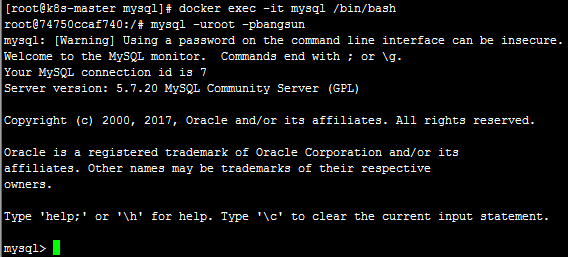

## 2、制作mysql-master镜像：

克隆GitHub上MySQL官方的Docekerfile和docker-entrypoint.sh文件：

```shell
git clone https://github.com/docker-library/mysql.git
```

**这里我选择了5.7版本的：**

### 2.1、修改Dockerfile：

```shell
vi Dockerfile
```

```shell
RUN sed -i '/\[mysqld\]/a server-id=1\nlog-bin' /etc/mysql/conf.d/docker.cnf
```

**命令解释：**

[sed命令详解](https://www.cnblogs.com/ev-zhk/p/4277023.html)

在docker.cnf文件中的[mysqld]下新增两行配置：

```shell
[mysqld]
server-id=1
log-bin
```

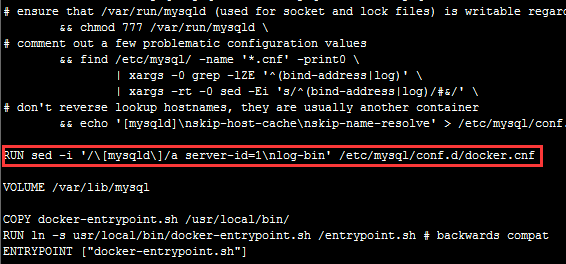

### 2.2、修改docker-entrypoint.sh：

```shell
vi docker-entrypoint.sh
```

```shell
echo "CREATE USER'$MYSQL_REPLICATION_USER'@'%' IDENTIFIED BY '$MYSQL_REPLICATION_PASSWORD';" |"${mysql[@]}"
echo "GRANT REPLICATION SLAVE ON *.*TO '$MYSQL_REPLICATION_USER'@'%' IDENTIFIED BY '$MYSQL_REPLICATION_PASSWORD';" |"${mysql[@]}"
echo 'FLUSH PRIVILEGES ;' |"${mysql[@]}"
```

**这三句话的意思授权远程用户；**

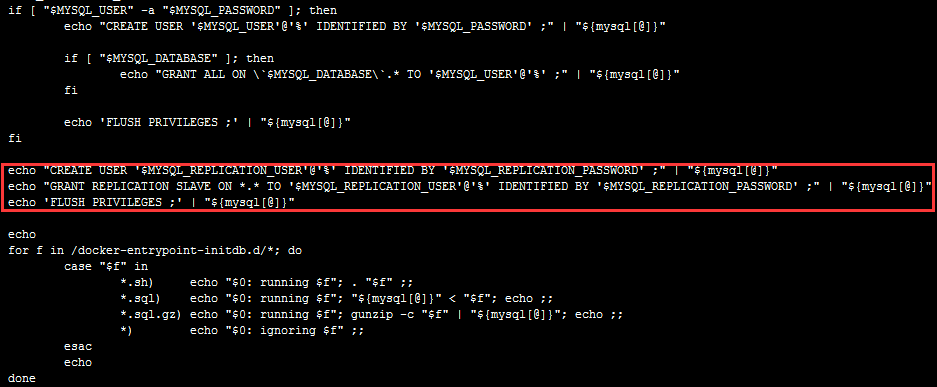

### 2.3、docker build镜像：

运行以下命令即可：

```shell
docker build -t jaychiu/mysql-master:5.7.21 .
```

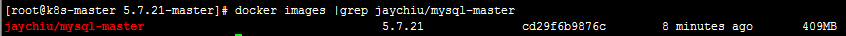

## 3、制作mysql-slave镜像：

### 3.1、修改Dockerfile：

```shell
vi Dockerfile
```

```shell
RUN RAND="$(date +%s | rev | cut -c1-2)$(echo ${RANDOM})" && sed -i '/\[mysqld\]/aserver-id='$RAND'\nlog-bin' /etc/mysql/conf.d/docker.cnf
```

**命令解释：**

在docker.cnf文件中的[mysqld]下新增两行配置：

```shell
[mysqld]
server-id=RAND
log-bin
```

这里server-id用的是随机数；

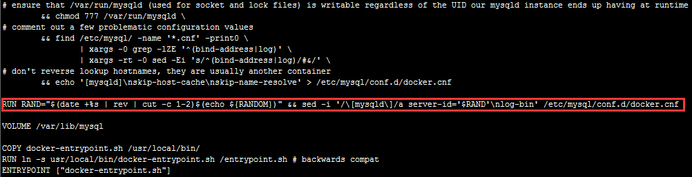

### 3.2、修改docker-entrypoint.sh：

```shell
vi docker-entrypoint.sh
```

```shell
echo "STOP SLAVE;" |"${mysql[@]}"
echo "CHANGE MASTER TO master_host='$MYSQL_MASTER_SERVICE_HOST',master_user='$MYSQL_REPLICATION_USER', master_password='$MYSQL_REPLICATION_PASSWORD';" |"${mysql[@]}"
echo "START SLAVE;" |"${mysql[@]}"
```

**注意：**

重要的来了，上面slave的配置中，master_host一项用的是$MYSQL_MASTER_SERVICE_HOST，这个环境变量（enviromnentvariable）是由k8s生成的。

k8s的service创建后，会自动分配一个cluster ip，这个cluster ip是动态的，我们没法直接使用或硬编码，k8s为了service对容器的可见，生成了一组环境变量，这些环境变量用于记录service name到cluster ip地址的映射关系，这样容器中就可以使用这些变量来使用service。（类似的，Docker中提供了links。）

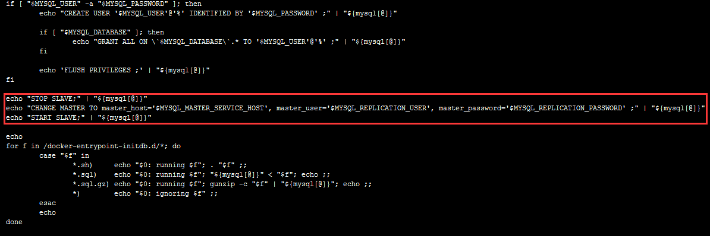

### 3.3、docker build镜像：

运行以下命令即可：

```shell
docker build -t jaychiu/mysql-slave:5.7.21 .
```


## 4、k8s部署：

### 4.1、mysql-master部署：

新建mysql-master-rc.yml文件和mysql-master-svc.yml文件；

```shell
vi mysql-master-rc.yml
```

```yaml
apiVersion: v1
kind: ReplicationController
metadata:
  name: mysql-master
  labels:
    name: mysql-master
spec:
  replicas: 1
  selector:
    name: mysql-master
  template:
    metadata:
      labels:
        name: mysql-master
    spec:
      containers:
      - name: mysql-master
        image: jaychiu/mysql-master:5.7.21
        ports:
        - containerPort: 3306
        env:
        - name: MYSQL_ROOT_PASSWORD
          value: "bangsun"
        - name: MYSQL_REPLICATION_USER
           value: "jaychiu"
        - name: MYSQL_REPLICATION_PASSWORD
           value: "bangsun"
```

部署mysql-master的rc服务：

```shell
kubectl create -f mysql-master-rc.yml
```

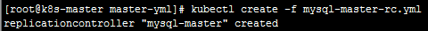

```shell
vi mysql-master-svc.yml
```

```yaml
apiVersion: v1
kind: Service
metadata:
  name: mysql-master
  labels:
    name: mysql-master
spec:
  ports:
  - port: 3306
    targetPort: 3306
  selector:
    name:mysql-master
```

部署mysql-master的svc服务：

```shell
kubectl create -f mysql-master-svc.yml
```

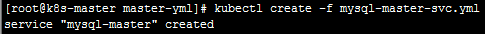

查看mysql-master的状态：

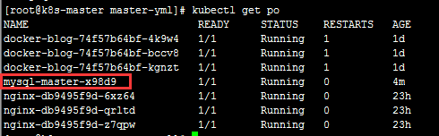

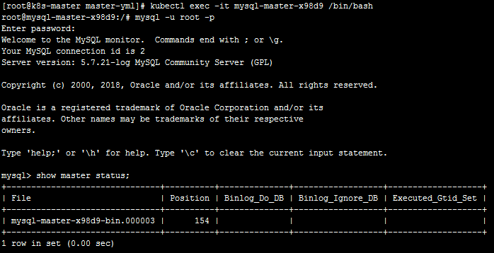

### 4.2、mysql-slave部署：

新建mysql-slave-rc.yml文件和mysql-slave-svc.yml文件；

```shell
vi mysql-slave-rc.yml
```

```yaml
apiVersion: v1
kind: ReplicationController
metadata:
  name: mysql-slave
  labels:
    name: mysql-slave
spec:
  replicas: 2
  selector:
    name: mysql-slave
  template:
    metadata:
      labels:
        name: mysql-slave
    spec:
      containers:
      - name: mysql-slave
        image: jaychiu/mysql-slave:5.7.21
        ports:
        - containerPort: 3306
        env:
        - name: MYSQL_ROOT_PASSWORD
          value: "bangsun"
        - name: MYSQL_REPLICATION_USER
          value: "jaychiu"
        - name: MYSQL_REPLICATION_PASSWORD
          value: "bangsun"
        - name: MYSQL_MASTER_SERVICE_HOST
          value: mysql-master
```


部署mysql-slave的rc服务：

```shell
kubectl create -f mysql-slave-rc.yml
```

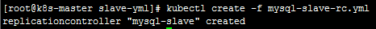

```shell
vi mysql-slave-svc.yml
```

```yaml
apiVersion: v1
kind: Service
metadata:
  name: mysql-slave
  labels:
    name: mysql-slave
spec:
  ports:
  - port: 3306
    targetPort: 3306
  selector:
    name:mysql-slave
```
部署mysql-slave的svc服务：

```shell
kubectl create -f mysql-slave-svc.yml
```

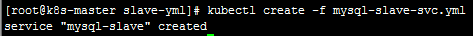

查看mysql-slave的状态：

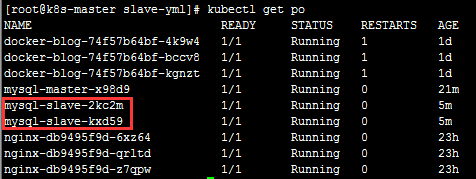

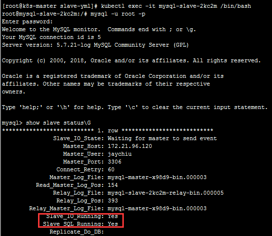

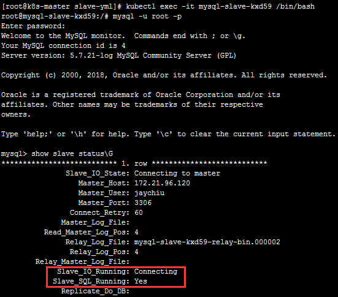

### 4.3、测试主从同步：

#### mysql-master上操作：

连接mysql-master的pod容器：

```shell
kubectl exec -it mysql-master-x98d9/bin/bash
```

连接mysql数据库：

```shell
mysql -uroot -p
```

创建数据库和表：

```sql
create database test1;
```
```sql
use test1;
```
```sql
create table test_tb(id int(3),namechar(10));
```
```sql
insert into test_tb values(001,'jay');
```

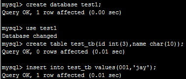

#### mysql-slave上查询：

连接mysql-slave的pod容器：

```shell
kubectl exec -it mysql-slave-2kc2m/bin/bash
```

连接数据库：

```shell
mysql -uroot -p
```

查询数据库和表：

```sql
show databases;
```
```sql
use test1;
```
```sql
select * from test_tb;
```
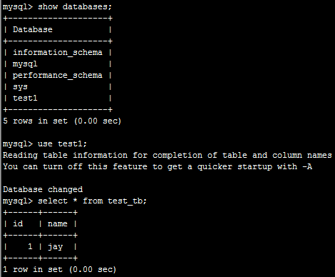